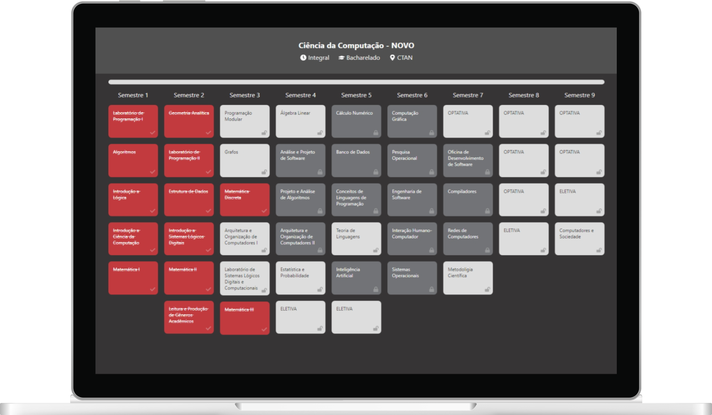

<h1>
    

        
    

</h1>

    <a href='https://curriculum-ufsj.vercel.app/'>curriculum-ufsj.vercel.app</a>
      
    
    &nbsp;
    
    &nbsp;
    
    &nbsp;
    
    &nbsp;
    

&nbsp;

    
    &nbsp;&nbsp;&nbsp;&nbsp;
    

&nbsp;

## 💡 Motivation

The goal of this project is to standardize the presentation of all courses at UFSJ ( __*Universidade Federal de São João del Rei*__ ) in an interactive way.

Currently, each course coordinator uses different methods to display course information, such as flowcharts and tables. However, this lack of consistency can be confusing for students.

By creating a standardized approach, this project aims to enhance the accessibility and clarity of course information, making it easier for students to understand their curriculum and plan their academic journey.

&nbsp;

## ✨ Features

### Front-End (React)

- 🌙 Light/Dark mode
- 🔍 Search course by name
- ✅ Interactive course progess
- 📱 Responsive layout (styled-components)

### Back-End (Express)

- ♻️ CRUD operations
- 🔌 API hosted in Vercel
- 🗃️ Data stored in MongoDB

&nbsp;

## 🛠️ Project Management

This project is maintened by [gabriel-dp](https://github.com/gabriel-dp), if you want to contribute in any way, get in touch with me!

Publishing data of all courses will take a significant amount of time as it will be added gradually. 😅
