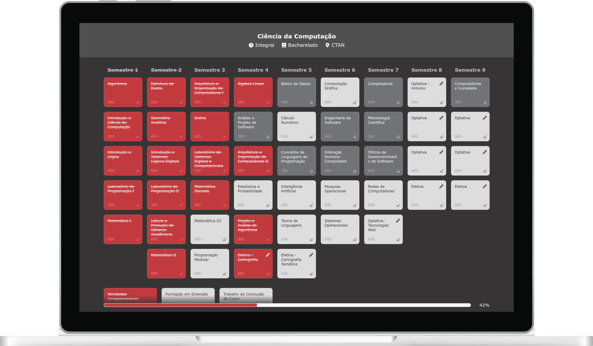
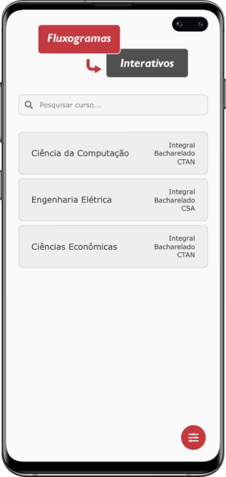

<!-- markdownlint-disable no-inline-html -->

<h1>
    <p align=center>
        
    </p>
</h1>

<p align=center>
    <a href='https://fluxogramas-interativos-ufsj.vercel.app/'>fluxogramas-interativos-ufsj.vercel.app</a>
    <br/><br/>
    
    &nbsp;
    
    &nbsp;
    
    &nbsp;
    
    &nbsp;
    
    &nbsp;
    
    &nbsp;
    
</p>

&nbsp;

<p align=center>
    
    &nbsp;&nbsp;&nbsp;&nbsp;
    
</p>

&nbsp;

## 💡 Motivation

The goal of this project is to standardize the presentation of all courses at UFSJ ( __*Universidade Federal de São João del Rei*__ ) in an interactive way.

Currently, each course coordinator uses different methods to display course information, such as flowcharts and tables. However, this lack of consistency can be confusing for students.

By creating a standardized approach, this project aims to enhance the accessibility and clarity of course information, making it easier for students to understand their curriculum and plan their academic journey.

&nbsp;

## ✨ Features

### Front-End (React)

- ✅ Interactive progess
- 💾 Auto saving
- 🖼️ Generate image
- 📱 Responsive layout
- 🌙 Light/Dark mode

### Back-End (Express)

- ♻️ CRUD operations
- 🔐 Login management using refresh tokens
- 🗃️ Data stored using PostgreSQL (Neon cluster)

&nbsp;

## 🛠️ Project Management

This project is maintened by [gabriel-dp](https://github.com/gabriel-dp), if you want to contribute in any way, get in touch with me!

Publishing data of all courses will take a significant amount of time as it will be added gradually. 😅

&nbsp;

---

&nbsp;

## 🖥️ Run locally

### Clone repository

```bash
git clone https://github.com/gabriel-dp/Fluxogramas-Interativos-UFSJ.git
cd Fluxogramas-Interativos-UFSJ
```

&nbsp;

### Install dependencies

```bash
npm install
```

&nbsp;

### Define environment variables

> View and fill server and client `.env` examples.

&nbsp;

### Run client, server and database

> You must have [Docker](https://www.docker.com/) installed.

```bash
npm run docker:up
```

&nbsp;

### Run server automated tests

> All tests are inside `__tests__` folder, ending with `.test.ts`

```bash
npm run test
```
